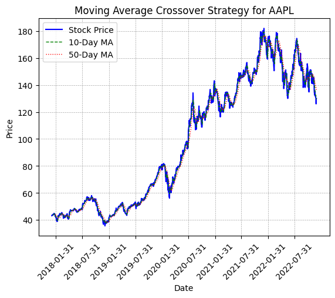
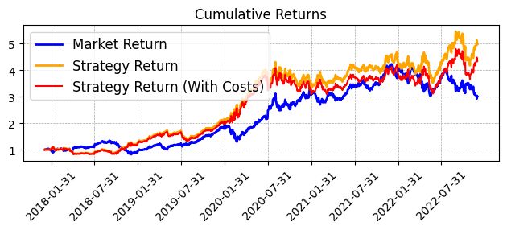

# Moving Average Crossover Strategy

Create a trading strategy based on the intersection of short-term and long-term moving averages.

## 1. Fetch Historical Data

We are using the price data from a popular stock [yfinance](https://github.com/ranaroussi/yfinance).
The dataset typically includes:

Ticker: Represents the stock symbol (e.g., "AAPL" for Apple Inc.).
Open: Price of the stock when the market opened for the day.
High: Highest price of the stock traded during the day.
Low: Lowest price of the stock traded during the day.
Close: Price of the stock when the market closed for the day.
Adj Close: A version of closing price accounting other factor affecting the stock value.
Volume: The number of shares traded during the time period.

## 2. Calculate short-long moving average.

Test various short/long moving average window combinations for better output. For this instance, 
we use 5 and 17 days respectively. (To change the value check **config.yaml** file)

```
    data["Short_MA"] = data["Close"].rolling(window=short_window).mean()
    data["Long_MA"] = data["Close"].rolling(window=long_window).mean()
```

## 3. Implement trading strategy.

Implement a moving average crossover strategy for a single stock. 

```
    # Generate buy/sell signals
    data['Signal'] = 0
    data.loc[data['Short_MA'] > data['Long_MA'], 'Signal'] = 1  # Buy signal
    data.loc[data['Short_MA'] <= data['Long_MA'], 'Signal'] = -1  # Sell signal

    # Identify when trades occur
    data['Trade'] = data['Signal'].diff().fillna(0).abs()
```

## 4. Simulate Trades

Backtest the strategy by simulating trades based on signals.

```

    # Backtest the strategy
    data['Daily_Return'] = data['Close'].pct_change()
    data['Strategy_Return'] = data['Signal'].shift(1) * data['Daily_Return']  # Lag signal by 1 day

    # Deduct transaction costs
    data['Strategy_Return_with_Costs'] = data['Strategy_Return'] - (data['Trade'] * transaction_cost)

    # Cumulative returns
    data['Cumulative_Market_Return'] = (1 + data['Daily_Return']).cumprod()
    data['Cumulative_Strategy_Return'] = (1 + data['Strategy_Return']).cumprod()
    data['Cumulative_Strategy_Return_with_Costs'] = (1 + data['Strategy_Return_with_Costs']).cumprod()
```

## 5. Evaluate Performance

Calculate key metrics to assess the strategy.

```
    sharpe_ratio_with_costs = data['Strategy_Return_with_Costs'].mean() / data['Strategy_Return_with_Costs'].std() * (252**0.5)

    print(f"Sharpe Ratio (With Costs): {sharpe_ratio_with_costs:.2f}")
```

## 6. Visualize Results

We use matplotlib to visualize stock price with short and long moving average.

<p align="center">
  
</p>

<p align="center">
  
</p>

## Collaboration

Feel free to use this codebase for your projects. If you want to talk more about this project or have found bugs, create a pull request or contact me on **pujantamang92@gmail.com**.

